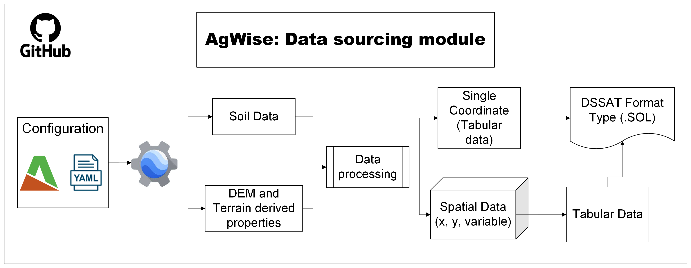

# Ag-Wise Data Sourcing: MODIS/VIIRS Time Series, SoilGrids, and Digital Elevation Model (DEM) Downloader

This repository provides a Python-based toolkit for downloading, processing, and visualizing vegetation index (VI) time series from MODIS and VIIRS satellite imagery, along with soil property data from SoilGrids and terrain attributes derived from a digital elevation model (DEM). All data acquisition is performed using the Google Earth Engine (GEE) platform.

The tools are intended for researchers who require analysis-ready geospatial datasets for applications such as crop monitoring and crop modeling.


<p align="center">
  
  <br>
  <em>Figure 1. Workflow</em>
</p>


### Repository Structure

```
.
├── GEEMODIS_data_download.ipynb
├── GEESoilGrids_data_download.ipynb
├── GEEElevation_data_download.ipynb
├── download_dem.ipynb
├── download_modis.ipynb
├── download_soildata.ipynb
├── README.md
├── gee_datasets
│   ├── __init__.py
│   ├── gee_data.py
│   ├── dem.py
│   ├── modis.py
│   ├── soil.py
│   └── processing_funs.py
└── utils
    └── plots.py
```

*   `GEEMODIS_data_download.ipynb`: A Jupyter Notebook explaining how to use the tools for downloading MODIS/VIIRS data.
*   `GEESoilGrids_data_download.ipynb`: A Jupyter Notebook explaining how to use the tools for downloading SoilGrids data.
*   `GEEElevation_data_download.ipynb`: A Jupyter Notebook explaining how to use the tools for downloading digital elevation data.
*   `gee_datasets/gee_data.py`: Contains the core classes (`GEEDataDownloader`) for interacting with Google Earth Engine and downloading data.
*   `gee_datasets/dem.py`:  DEM-specific tools for extracting elevation, slope, aspect, and other terrain metrics.
*   `gee_datasets/soil.py`:  SoilGrids download tools and utilities.
*   `gee_datasets/processing_funs.py`: Includes functions for time series processing, such as gap filling and smoothing.
*   `utils/plots.py`: Provides helper functions for plotting the time series data.


## Installation

Follow the following code to install and configure the Ag-Wise Data Sourcing toolkit.

``` Bash
git clone https://github.com/anaguilarar/agwise_data_sourcing.git
cd agwise_data_sourcing

conda create -n agwise python=3.10
conda activate agwise

pip install -r requirements.txt

earthengine authenticate

```

*Optional*: you can intall the module to transform soil data into the DSSAT format

``` Bash
git clone https://github.com/anaguilarar/WeatherSoilDataProcessor.git
pip install -r WeatherSoilDataProcessor/requirements.txt

```

This project requires the following Python libraries:
*   `earthengine-api`
*   `pandas`
*   `matplotlib`
*   `geemap`
*   `jupyter`

## Features

*   **MODIS/VIIRS Data Download**: Download VI data (e.g., NDVI) from MODIS and VIIRS products for a specified country and time range.
*   *   **Data Processing**:
        *   **Gap Filling**: Linear interpolation to fill gaps in the time series caused by cloud cover or other issues.
        *   **Smoothing**: Savitzky-Golay filter to smooth the time series and reduce noise.
*   *   **Crop Masking**: Apply a crop mask to focus the analysis on agricultural areas.

*   **SoilGrids Data Download**: Download soil property data (e.g., sand content, pH) for a specified country, administrative level, or specific coordinate.
*   *   **Datacube Creation**: Create a NetCDF datacube from multiple downloaded soil properties.
*   *   **Convert to DSSAT format type file**: Create a file that can be read using DSSAT process base model.

*   **Digital Elevation Model (DEM) and Terrain Derivatives**: Download terrain variables derived from DEMs, such as:
    *   Elevation
    *   Slope
    *   Aspect

*   **Visualization**: Plot raw and processed time series data, and visualize masked data on an interactive map using `geemap`.


## Usage example using Command-Line (for Automation)

There are examples that uses CLI and YAML files for setting configurations. These examples can be executed through the terminal.

*   **SoilGrids Download**

YAML configuration file:

``` Yaml
GENERAL_SETTINGS:
  ee_project_name: YOUR-GEE-PROJECT
  donwnload_data_cube: False
  donwnload_coordinatedata_asdssat: False
  output_path: runs
  donwnload_area_asdssat: True

DATA_DOWNLOAD:
  ADM0_NAME: Kenya
  ADM1_NAME: Kericho
  ADM2_NAME: null
  property: sand
  properties: ['bdod', 'cec', 'cfvo', 'clay', 'sand', 'silt', 'nitrogen', 'soc', 'phh2o', 'wv0010', 'wv0033', 'wv1500']
  depths: ['0_5', '5_15', '15_30', '30_60', '60_100', '100_200']
  coordinate: [37.8, -1.4]
  output_path: soil.nc
  adm_level: 'ADM1'
  scale: 250
  n_workers: 5

DSSAT_process:
  soil_properties: ['bdod', 'cec', 'cfvo', 'clay', 'sand', 'silt', 'nitrogen', 'soc', 'phh2o', 'wv0010', 'wv0033', 'wv1500']
  soil_id: 'TRAN00001'
  output_fn: 'SOL'
  dssat_processor_path: '/scripts/'

```
Run from terminal

``` Bash
python download_soildata.py -config yaml_configurations/soil_data_download.yaml
```

*   **DEM Download**

YAML configuration file:

``` Yaml
GENERAL_SETTINGS:
  ee_project_name: YOUR-GEE-PROJECT
  donwnload_as_raster: True
  donwnload_coordinatedata: False
  output_path: runs

DATA_DOWNLOAD:
  source: nasadem
  ADM0_NAME: Kenya
  ADM1_NAME: Kisumu
  coordinate: [37.8, -1]
  adm_level: 'ADM1'
  scale: 250
```
Run from terminal

``` Bash
python download_dem.py -config yaml_configurations/dem_data_download.yaml
```

*   **MODIS Download**

YAML configuration file:

``` Yaml
GENERAL_SETTINGS:
  ee_project_name: YOUR-GEE-PROJECT
  output_path: runs
  use_case: null

DATA_DOWNLOAD:
  ADM0_NAME: Kenya
  ADM1_NAME: Kakamega
  ADM2_NAME: null 
  product: MOD13Q1
  starting_date: '2022-06-01'
  ending_date: '2023-07-01'
  adm_level: 'ADM1'
  scale: 250
  n_workers: 5
  band: NDVI


PREPROCESSING:
  data_filling: True
  sg_smoothing: True
  sg_window: 3
  crop_mask: True
  crop_mask_product: 'ESA'

```
Run from terminal

``` Bash
python download_modis.py -config yaml_configurations/modis_data_download.yaml
```


## Using the code in R
The scripts can also be executed from R using the reticulate package. To run the script in R, it is needed to indicate the conda enviroment which previously created (check Intallation section). Then you will need to set the working directory on the github repository clone.

``` R

rm(list = ls())

install.packages('reticulate')
library(reticulate)

## add the create enviorment in conda
Sys.setenv(RETICULATE_CONDA = "/opt/conda/lib/conda")
use_condaenv("agwise", required = TRUE)

## check the configuration
py_config()

# cghange the directory
setwd('/home/jovyan/agwise-datasourcing/dataops/agwise_data_sourcing/')

# run the script
system('/home/jovyan/.conda-envs/agwise/bin/python download_dem.py -config yaml_configurations/dem_data_download.yaml')


```

If successful, you will see output similar to:

``` TXT

            ========================================
            |                                      |
            |         AGWISE DATA SOURCING         |    
            |               GEEdem                 |
            |                                      |
            ========================================      
      
yaml_configurations/dem_data_download.yaml
-------> Starting:  yaml_configurations/dem_data_download.yaml
250
data will be processed for: Kisumu
-------> DEM data sownloaded in:  runs/kisumu_250.tif

```
### Editing YAML Configurations from R

In addition to running the Ag-Wise Data Sourcing tools from the terminal, it is also possible to modify and execute YAML configuration files directly from R.

``` R
library(yaml)
library(reticulate)
Sys.setenv(RETICULATE_CONDA = "/opt/conda/lib/conda")
use_condaenv("agwise", required = TRUE)

# Set working directory to the cloned repository
setwd('/home/jovyan/agwise-datasourcing/dataops/agwise_data_sourcing/')

# Load the YAML configuration file: 'yaml_configurations/dem_data_download.yaml'
config_data <- read_yaml("yaml_configurations/dem_data_download.yaml")

# Modify the parameter of interest in this case as example the county
config_data$DATA_DOWNLOAD$ADM1_NAME = 'Siaya'
# export the file 
write_yaml(config_data, "yaml_configurations/dem_data_download_Siaya.yaml")

# run the code
system('/home/jovyan/.conda-envs/agwise/bin/python download_dem.py -config yaml_configurations/dem_data_download_Siaya.yaml')

```

``` TXT
            ========================================
            |                                      |
            |         AGWISE DATA SOURCING         |    
            |               GEEdem                 |
            |                                      |
            ========================================      
      
yaml_configurations/dem_data_download_Siaya.yaml
-------> Starting:  yaml_configurations/dem_data_download_Siaya.yaml
250
data will be processed for: Siaya
-------> DEM data sownloaded in:  runs/siaya_250.tif

```
